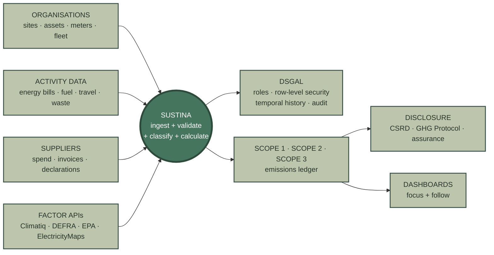
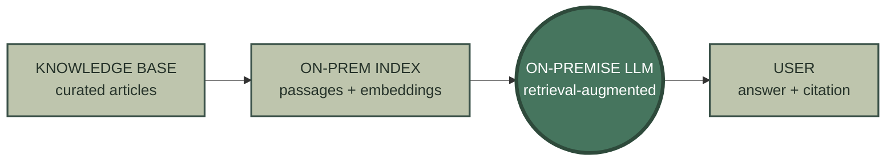

# Sustina

**The ESG and sustainability-reporting platform for business — one governed data
foundation, audited end to end, delivered as a service.**

Sustina turns the messy reality of emissions, energy, water, waste, travel and
supplier data into **regulator-ready Scope 1, 2 and 3 reporting**. Every fact is
classified, access-controlled and lineage-tracked from the moment it lands —
because the data describes **identifiable third parties** and **sensitive
proprietary operations**, and GDPR and client confidentiality are non-negotiable.

## The platform, by surface

| Surface | What it is |
|---|---|
| [**sustina-data-modelling**](https://github.com/sustina-nrgpix/sustina-data-modelling) | The data foundation — DSGAL-first database, the data classes, reference data and the Scope 1/2/3 emissions model |
| [**sustina-security**](https://github.com/sustina-nrgpix/sustina-security) | Data Security, Governance, Access &amp; Lineage — role model, row-level security, audit, and the single authorised path to data |
| [**sustina-web**](https://github.com/sustina-nrgpix/sustina-web) | The browser surface — the public site and the authenticated ESG management workspace |
| [**sustina-backoffice**](https://github.com/sustina-nrgpix/sustina-backoffice) | The restricted back office — administration console, access assignment and reference-data management |
| [**sustina-cloud**](https://github.com/sustina-nrgpix/sustina-cloud) | The cloud landscape — AWS Lambda business logic, DB-as-a-Service middleware, the BFF and the external factor APIs |
| [**sustina-knowledge-base**](https://github.com/sustina-nrgpix/sustina-knowledge-base) | The knowledge base — the curated corpus behind Sustina's on-premise, LLM-driven assistant |

## Dig deeper

- **DSGAL-first foundation** — why strong controls go in *before* any application
  table exists: [sustina-data-modelling](https://github.com/sustina-nrgpix/sustina-data-modelling)
- **Data classes** — Organization, Site, Meter, Asset, EmissionFactor,
  FactorApplication, DataQualityAssessment and ~25 more
- **Architecture** — React → thin ASP.NET Core proxy → C# AWS Lambda, with all
  secrets and SQL kept behind the Lambda boundary:
  [sustina-cloud](https://github.com/sustina-nrgpix/sustina-cloud)
- **Role-level security & GDPR** — default-deny, centralised roles, row-level
  security on every governed table: [sustina-security](https://github.com/sustina-nrgpix/sustina-security)
- **Python standard** — every script starts from the shared template; proprietary
  material never touches Colab; functions run on AWS Lambda

> Capabilities are documented as *As a / I want / So that* briefs with conceptual
> diagrams — what each part does and the value it delivers, not its internals.

## Knowledge Base

Sustina runs its **own on-premise, LLM-driven knowledge base**. The in-product
assistant answers questions — reporting rules, data standards, how a feature
works — from a model that runs **inside Sustina's own boundary** and draws
**only** on vetted internal material. Client data, proprietary operational detail
and supplier records are never sent to an external model, and every answer
**cites the source** it came from.

The curated articles behind it are versioned in
[**sustina-knowledge-base**](https://github.com/sustina-nrgpix/sustina-knowledge-base) —
each a short, standalone reference with a permanent KB number.

## Data protection

Personal data — the people named in supplier, travel and operational records — is
governed by design: **default-deny**, access through centralised roles, row-level
security bound to every governed table, full temporal history, and JSON
before/after audit for regulator-grade traceability. All reads and writes go
through the **DB-as-a-Service** layer; developers never touch the databases
directly.

---
Copyright © 2024–2026 Neill Watcyn-Palmer. All rights reserved. Proprietary — see LICENSE.
